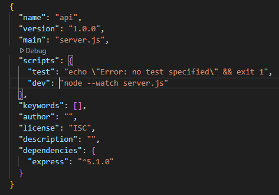

# SpoolFox

## About the Project
If you are into 3D printing, you may know the struggle of searching for a good spool of filament. SpoolFox is intended to help reduce the time to search for top brands and material types by going to one place and filtering based of your preferences and/or needs. SpoolFox has the ability to filter spools based on material type, brand and varients(ie. transparent, glow in the dark, gradient in color). I started this project with a mobile first design, so it is responsive across different sizes from 325px and past 1200px. This is a single page website, once you first arrive you will see all of the spools of filament that are available to see, on what I like to call spool cards, these cards hold the important data and specifications so users can make sure it fits your printer. On the mobile and tablet versions I gave them both easily accessable buttons that quickly filter based on material type or brand, both buttons will drop down a menu of either material types or brands for the user to select. From a laptop sized screen these quick-filter buttons will vanish and a checkbox style of filtering will appear for the user to filter with more options to select from, to further reduce scroll time and find that perfect match for them to purchase. Once the user found a spool they are happy with they may click the picture on the spool cards, at which point will jump them to where they can purchase the spool. If users do not want to users filters at all, they can use a readily available search bar that will automatically display their search results, if their search results are found. For the search bar, I have limited it to a max of 11 characters and it does not allow special characters. The page will alert the user if a special character was used or no results, so they may adjust their search input to get the results they want.

The API used is one that I built in a json file. Using node and express to run my server I was able to run both the API and the front-end from my back-end file at the same time, I did this so that way if one is up so would the other.

## Built With
For this project, I built it with HTML, CSS, and Javascript for the front-end, and the back-end used node and express in a Javascript file to power it and the front-end.

## Features
Key features used in this project:

1. Created a node.js web server using a Express.js

2. Built an API that has data persisted to it and is accessible in the web app  by storing the data in a JSON file

3. Used a regular expression to validate user input and informed the user about it.

## Getting Started

You will need to have NodeJS installed on your computer before these next steps.

To run this project, you will need to go to your terminal:

1. git clone https://github.com/3DMystic/SpoolFox.git

2. For this step I prefer to go to my package.json file and in the "scripts" object, change "start" to "dev" and change its value to "node --watch server.js". This will allow you to make your own changes and simply refresh the page to see any changes you made.
    Once this is done, it should look like this -
    

  If you choose not to make any changes to the package.json file you can skip to the next step.

3. change directory to were you are in SpoolFox-capstone-2025/api

4. npm run dev or npm server.js (only if you skipped step 4).

  Once you are running you can go to http://localhost:8080/ to see the page live or http://localhost:8080/api/filamentSpools for a full list of current filament spool data
  that I used to display the front-end.